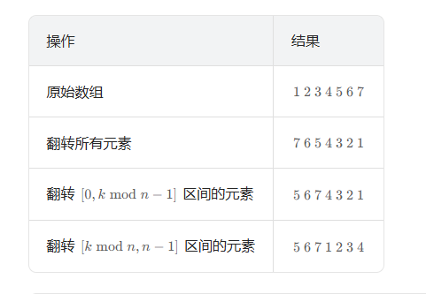

# 数组+哈希表

## **LeetCode27——**移除元素

#### 思路1：创建一个等大的空间，但不知道python怎么创建列表，

#### 题解思路1：双指针法

大致思路：这个题的要求就是左边是不是val的数，所以利用双指针，左指针每次指向可以赋值的地方，右指针遍历

第一次解题代码（通过）：

> class Solution:
>
>   def removeElement(self, nums: List[int], val: int) -> int:
>
> ​    left,right = 0,0
>
> ​    numsLen = len(nums)
>
> ​    while right<numsLen:
>
> ​      if nums[right] == val:
>
> ​        right = right + 1
>
> ​      else:
>
> ​        nums[left] = nums[right]
>
> ​        left = left + 1
>
> ​        right = right + 1
>
> ​    return left

学习提升：1.但凡涉及到数组遍历，就思考一下利用双指针行不行

2. python中没有++。你就用+=         left+=1
3. 如果想要复制一维数组直接.copy(),修改互不影响，如果复制二维数组不能用copy，修改原来数组的值，复制的数组的值也会改变。如果只是单纯的创建一个数组，就直接arr = []

#### 双指针法的延申：

1.双向双指针（对撞指针）

> **适用场景：**
>
> - 有序数组中查找满足条件的元素对
> - 字符串回文判断
> - 反转数组/字符串
> - 三数之和、四数之和问题
>
> **经典题目：**
>
> #### 🔥 基础题
>
> - **LeetCode 167 - 两数之和 II（输入有序数组）**
> - **LeetCode 344 - 反转字符串**
> - **LeetCode 125 - 验证回文串**
> - **LeetCode 11 - 盛最多水的容器**
>
> #### 🔥 进阶题
>
> - **LeetCode 15 - 三数之和**
>
> - **LeetCode 18 - 四数之和**
>
> - **LeetCode 42 - 接雨水**
>
> - # 对撞指针模板
>   def two_sum_sorted(nums, target):
>       left, right = 0, len(nums) - 1
>       while left < right:
>           current_sum = nums[left] + nums[right]
>           if current_sum == target:
>               return [left, right]
>           elif current_sum < target:
>               left += 1
>           else:
>               right -= 1
>       return []

2.2. 快慢指针（同向双指针）

> **特点：** 两个指针同方向移动，速度不同
>
> **适用场景：**
>
> - 数组元素删除/移动
> - 去重操作
> - 链表环检测
> - 寻找链表中点
>
> **经典题目：**
>
> #### 🔥 数组操作
>
> - **LeetCode 27 - 移除元素**（就是你刚才的题目！）
> - **LeetCode 26 - 删除有序数组中的重复项**
> - **LeetCode 80 - 删除有序数组中的重复项 II**
> - **LeetCode 283 - 移动零**
> - **LeetCode 88 - 合并两个有序数组**
>
> #### 🔥 链表问题
>
> - **LeetCode 141 - 环形链表**
> - **LeetCode 142 - 环形链表 II**
> - **LeetCode 876 - 链表的中间结点**
> - **LeetCode 19 - 删除链表的倒数第N个节点**
>
> 
>
> python

```python
# 快慢指针模板（数组去重）
def remove_duplicates(nums):
    slow = 0
    for fast in range(1, len(nums)):
        if nums[fast] != nums[slow]:
            slow += 1
            nums[slow] = nums[fast]
    return slow + 1

# 快慢指针模板（链表环检测）
def has_cycle(head):
    slow = fast = head
    while fast and fast.next:
        slow = slow.next
        fast = fast.next.next
        if slow == fast:
            return True
    return False
```

3. 滑动窗口（特殊的双指针）

> **特点：** 维护一个窗口，动态调整窗口大小
>
> **适用场景：**
>
> - 子串/子数组问题
> - 最长/最短满足条件的区间
> - 固定长度窗口的最值问题
>
> **经典题目：**
>
> #### 🔥 定长窗口
>
> - **LeetCode 643 - 子数组最大平均数 I**
> - **LeetCode 1456 - 定长子串中元音的最大数目**
>
> #### 🔥 不定长窗口
>
> - **LeetCode 3 - 无重复字符的最长子串**
> - **LeetCode 76 - 最小覆盖子串**
> - **LeetCode 209 - 长度最小的子数组**
> - **LeetCode 424 - 替换后的最长重复字符**
> - **LeetCode 438 - 找到字符串中所有字母异位词**
>
> 
>
> python

```python
# 滑动窗口模板
def sliding_window(s, target):
    left = 0
    window = {}
    result = []
    
    for right in range(len(s)):
        # 扩展窗口
        char = s[right]
        window[char] = window.get(char, 0) + 1
        
        # 收缩窗口
        while condition_met(window, target):
            # 更新结果
            result.append(left)
            
            # 左指针右移
            left_char = s[left]
            window[left_char] -= 1
            if window[left_char] == 0:
                del window[left_char]
            left += 1
    
    return result
```


## LeetCode 1 两数之和

#### 思路一：就是先把数组排序一下然后用双指针，但问题是现在不清楚用什么算法排序，等会chat一下

你真是脑残，这个一看就有问题，你排序之后数的位置不就变了吗？，你这个还得记录原来数据的位置，更麻烦了，错误的代码：

> class Solution:
>
>   def twoSum(self, nums: List[int], target: int) -> List[int]:
>
> ​    nums.sort()
>
> ​    left,right = 0,len(nums)-1
>
> ​    while left<right:
>
> ​      if nums[left]+nums[right] > target:
>
> ​        right -= 1
>
> ​      elif nums[left]+nums[right] < target:
>
> ​        left += 1
>
> ​      else:
>
> ​        return [left,right]

#### 学习思路一：使用哈希表。这个刚开始考虑到了，但想成c++的了（创建一个特别大的数组），后面看题解发现竟然可以用dict作为哈希表，我真服了，等会补充一下dict的知识。不会拼写enumerate

```python
class Solution:

  def twoSum(self, nums: List[int], target: int) -> List[int]:

​    hashTable = dict()

​    for i,num in enumerate(nums):

​      if target-num in hashTable:

​        return [hashTable[target-num],i]

​      else:

​        hashTable[num] = i
```


## LeetCode 49 字母异位词分组

思路1：很麻烦很麻烦，写到一半不知道怎么用哈希表来判断他们俩是不是一个了：

> class Solution:
>
> ​    def groupAnagrams(self, strs: List[str]) -> List[List[str]]:
> ​        result = []
> ​        strsLen = len(strs)
> ​        flags = [0 for i in range(strsLen)]  # 修正：range(strsLen)
> ​        
> ​        for i in range(strsLen):  # 修正：range(strsLen)
> ​            if flags[i] == 1:
> ​                continue
> ​            flags[i] = 1
> ​            tempList = [strs[i]]  # 先把当前字符串加入
> ​            
>    ​         # 构建当前字符串的字符频率表
> ​            hashTable = {}
> ​            for j in strs[i]:
> ​                if j in hashTable:
> ​                    hashTable[j] += 1
> ​                else:
> ​                    hashTable[j] = 1
> ​            
>
>             # 检查后续字符串是否为异位词
> ​            k = i + 1
> ​            while k < strsLen:
> ​                if flags[k] == 0:  # 只检查未处理的字符串
>    ​                 # 构建当前待比较字符串的字符频率表
> ​                    tempHashTable = {}
> ​                    for s in strs[k]:
> ​                        if s in tempHashTable:
> ​                            tempHashTable[s] += 1
> ​                        else:
> ​                            tempHashTable[s] = 1
> ​                    
>    ​                 # 比较两个哈希表是否相同
> ​                    if hashTable == tempHashTable:
> ​                        tempList.append(strs[k])
> ​                        flags[k] = 1  # 标记为已处理
> ​                k += 1
> ​            
> ​            result.append(tempList)
> ​        
> ​        return result

官方计数代码太夸张了：

> class Solution:
>
>   def groupAnagrams(self, strs: List[str]) -> List[List[str]]:
>
> ​    mp = collections.defaultdict(list)
>
> 
>
> ​    for st in strs:
>
> ​      counts = [0] * 26
>
> ​      for ch in st:
>
> ​        counts[ord(ch) - ord("a")] += 1
>
> ​      \# 需要将 list 转换成 tuple 才能进行哈希
>
> ​      mp[tuple(counts)].append(st)
>
> ​    
>
> ​    return list(mp.values())


> 
>
> class Solution:
>
>   def groupAnagrams(self, strs: List[str]) -> List[List[str]]:
>
> ​    mp = collections.defaultdict(list)
>
> 
>
> ​    for st in strs:
>
> ​      key = "".join(sorted(st))
>
> ​      mp[key].append(st)
>
> ​    
>
> ​    return list(mp.values())

#### 解法1：（报错了，list.sort()是原地排序，并返回none），自己解决的思路：用字典存储，利用tuple来当key

```python
class Solution:

  def groupAnagrams(self, strs: List[str]) -> List[List[str]]:

​    hashMap = {}

​    result = []

​    for i in range(len(strs)):

​      tempList = [j for j in strs[i]]

​      tempList.sort()

​      if tuple(tempList) in hashMap.keys():

​        hashMap[tuple(tempList)].append(strs[i])

​      else:

​        hashMap[tuple(tempList)] = [strs[i]]

​    for i in hashMap.keys():

​      result.append(hashMap[i])

​    return result
```

#### 官方题解  学习点1：

class Solution:

  def groupAnagrams(self, strs: List[str]) -> List[List[str]]:

​    mp = collections.defaultdict(list)


​    for st in strs:

​      key = "".join(sorted(st))

​      mp[key].append(st)

​    

​    return list(mp.values())

> 在这个字母异位词分组的解法中，使用 `collections.defaultdict` 而非 Python 内置的普通 `dict`，主要是为了**简化代码逻辑并避免键不存在的错误**。
>
> 具体来说，两者的核心差异在于处理「键不存在」的场景：
>
> 1. **普通 `dict` 的问题**
>    当你尝试给一个不存在的键赋值时（如 `mp[key].append(st)`），普通字典会直接抛出 `KeyError`。
>    因此需要先判断键是否存在，代码会更繁琐：
>
>    python
>
>    
>
>    运行
>
>    
>
>    ```python
>    mp = {}
>    for st in strs:
>        key = "".join(sorted(st))
>        if key not in mp:  # 必须先判断，否则可能报错
>            mp[key] = []
>        mp[key].append(st)
>    ```
>
>    **`defaultdict` 的优势**
>    `collections.defaultdict` 允许你指定一个「默认工厂函数」（如 `list`）。
>    当访问不存在的键时，它会自动调用该函数创建一个默认值（如空列表 `[]`），无需手动初始化：
>
>    
>
>    ```python
>    mp = collections.defaultdict(list)  # 指定默认值为列表
>    for st in strs:
>        key = "".join(sorted(st))
>        mp[key].append(st)  # 键不存在时自动创建空列表，直接 append 即可
>    ```
>
>    
>
> 
>
> 简单说，`defaultdict` 在这里的作用是**省去了判断键是否存在并手动初始化的步骤**，让代码更简洁、可读性更高。
>
> 
>
> 在功能上，两种写法最终结果完全一致，但 `defaultdict` 版本的代码更优雅，尤其适合这种「键对应的值是容器类型（列表、集合等）」的场景。


## Leetcode128 最长连续序列

#### 思路1：没考虑到数字重复的情况：（待解决：遍历）

class Solution:

  def longestConsecutive(self, nums: List[int]) -> int:

​    nums.sort()

​    arr = [1]*len(nums)

​    for i in range(len(nums)): #怎么从1开始遍历呢？

​      if i == 0:

​        continue

​      if nums[i]-1 == nums[i-1]:

​        arr[i] = arr[i-1] + 1

​    return max(arr) 

最后通过先转换成set再排序，解决：

class Solution:

  def longestConsecutive(self, nums: List[int]) -> int:

​    if len(nums) == 0:

​      return 0

​    nums = list(set(nums))

​    nums.sort()

​    arr = [1]*len(nums)

​    for i in range(len(nums)): #怎么从1开始遍历呢？

​      if i == 0:

​        continue

​      if nums[i]-1 == nums[i-1]:

​        arr[i] = arr[i-1] + 1

​    return max(arr) 

# 双指针

## Leetcode 284 移除0

#### 思路1：用双指针，但第一次报错了，第一次直接把j赋值到i，然后就把j赋值为0，如果是【1】，最后就会被修改为【0】，所以就应该最后再遍历赋值一下，还有就是while一定要在while里面改变判断值

```
class Solution:

  def moveZeroes(self, nums: List[int]) -> None:

​    """

​    Do not return anything, modify nums in-place instead.

​    """

​    i = 0

​    for j in range(len(nums)):

​      if nums[j] != 0:

​        nums[i] = nums[j]

​        i += 1

​    k = i

​    while k<len(nums):

​      nums[k] = 0

​      k += 1
```

但leetcode官方题解有一个简单思路，就是直接交换元素,

class Solution:

  def moveZeroes(self, nums: List[int]) -> None:

​    n = len(nums)

​    left = right = 0

​    while right < n:

​      if nums[right] != 0:

​        nums[left], nums[right] = nums[right], nums[left]

​        left += 1

​      right += 1

## Leetcode 11盛最多水的容器

#### 思路1：最小的一边需要移动，easy

```
class Solution:

  def maxArea(self, height: List[int]) -> int:

​    i,j = 0,len(height)-1

​    maxWater = -1

​    while i<j :

​      water = (j-i) * min(height[i],height[j])

​      maxWater = max(water,maxWater)

​      if height[i]<=height[j]:

​        i += 1

​      else:

​        j -= 1

​    return maxWater
```


## Leetcode 15 三数之和

```
claude题解：
class Solution:
    def threeSum(self, nums: List[int]) -> List[List[int]]:
        nums.sort()
        result = []
        
        for i in range(len(nums) - 2):  # 只需要遍历到倒数第三个元素
            # 跳过重复的第一个数
            if i > 0 and nums[i] == nums[i-1]:
                continue
                
            left = i + 1
            right = len(nums) - 1
            
            while left < right:
                current_sum = nums[i] + nums[left] + nums[right]
                
                if current_sum == 0:
                    result.append([nums[i], nums[left], nums[right]])
                    
                    # 跳过重复的left值
                    while left < right and nums[left] == nums[left + 1]:
                        left += 1
                    # 跳过重复的right值
                    while left < right and nums[right] == nums[right - 1]:
                        right -= 1
                        
                    left += 1
                    right -= 1
                    
                elif current_sum < 0:
                    left += 1
                else:
                    right -= 1
                    
        return result
```

自己写的没解决出来超过时间限制了o3n：

```
class Solution:
    def threeSum(self, nums: List[int]) -> List[List[int]]:
        nums.sort()
        result = []
        for i in range(len(nums)):
            if i-1>=0 and nums[i] == nums[i-1]:
                continue
            for j in range(i+1,len(nums)):
                if j-1>i and nums[j] == nums[j-1]:
                    continue
                target = 0-nums[i]-nums[j]
                k = len(nums)-1
                while k>j:
                    if k+1 < len(nums)-1 and nums[k] == nums[k+1]:
                        continue
                    if nums[k] > target:
                        k -= 1
                    elif nums[k] == target:
                        temp = [nums[i],nums[j],nums[k]]
                        result.append(temp)
                        break
                    elif nums[k] < target:
                        break
        return result
            
```


## Leetcode42 接雨水

ac了，但python遍历还是不太熟练，倒序遍历不会

```
class Solution:

  def trap(self, height: List[int]) -> int:

​    lenH = len(height)

​    leftMax = [0] * lenH

​    rightMax = [0] * lenH

​    tempMaxLeft = 0

​    tempMaxRight = 0


​    \# 计算左侧最大值

​    for i in range(lenH - 1):

​      if height[i] > tempMaxLeft:

​        tempMaxLeft = height[i]

​        leftMax[i + 1] = tempMaxLeft

​      else:

​        leftMax[i + 1] = tempMaxLeft


​    \# 计算右侧最大值

​    j = lenH - 1

​    while j > 0:

​      if tempMaxRight < height[j]:

​        tempMaxRight = height[j]

​        rightMax[j - 1] = height[j]

​      else:

​        rightMax[j - 1] = tempMaxRight

​      j -= 1


​    \# 计算接水量

​    maxResult = 0

​    for i in range(lenH):

​      if height[i] < min(leftMax[i], rightMax[i]):

​        maxResult += min(leftMax[i], rightMax[i]) - height[i]


​    return maxResult
```

## Leetcode 3 [无重复字符的最长子串](https://leetcode.cn/problems/longest-substring-without-repeating-characters/)

#### 思路一：思路没问题，但只考虑到是字母了，没考虑到空格和数字等情况：,还有就是python中取char得用ord

class Solution:

  def lengthOfLongestSubstring(self, s: str) -> int:

​    if s ==" ":

​      return 1

​    flags = [0]*26

​    left ,right = 0 ,0

​    maxLen = 0

​    while right<len(s): #暂定

​      if flags[ord(s[right])-ord('a')] == 0:

​        flags[ord(s[right])-ord('a')] = 1

​        right += 1

​        maxLen = max(right-left,maxLen)

​      else:

​        while left<=right:

​          if  ord(s[left])-ord('a') == ord(s[right])-ord('a'):

​            flags[ord(s[left])-ord('a')] = 0

​            left += 1

​            break

​          else:

​            flags[ord(s[left])-ord('a')] = 0

​            left += 1

​        

​    return maxLen


#### 最终通过把列表换成collections.defaultdict解决问题：

思路没问题，一直保证滑动窗口里是符合条件的

```
class Solution:

  def lengthOfLongestSubstring(self, s: str) -> int:

​    flags = collections.defaultdict(int)

​    left ,right = 0 ,0

​    maxLen = 0

​    while right<len(s): #暂定

​      if flags[ord(s[right])] == 0:

​        flags[ord(s[right])] = 1

​        right += 1

​        maxLen = max(right-left,maxLen)

​      else:

​        while left<=right:

​          if  ord(s[left]) == ord(s[right]):

​            flags[ord(s[left])] = 0

​            left += 1

​            break

​          else:

​            flags[ord(s[left])] = 0

​            left += 1

  

​    return maxLen
```

## Leetcode 438 [找到字符串中所有字母异位词](https://leetcode.cn/problems/find-all-anagrams-in-a-string/)

#### 思路1：滑动窗口

```

class Solution:

  def judgeSame(self,arr1,arr2):

​    for i in range(26):

​      if arr1[i] != arr2[i]:

​        return False  #python中true和false是小写

​    return True

  def findAnagrams(self, s: str, p: str) -> List[int]:

​    answerArr = [0] * 26

​    tempArr = [0] * 26

​    lenP = len(p)

​    lenS = len(s)

​    for i in p:

​      answerArr[ord(i)-ord('a')] += 1

​    left , right = 0 , 0

​    result = []

​    while right <= lenS and left <= right:

​      if right - left <lenP :

​        if right<lenS:

​          tempArr[ord(s[right])-ord('a')] += 1

​        right += 1

​      else:

​        if self.judgeSame(answerArr,tempArr):

​          result.append(left)


​        tempArr[ord(s[left])-ord('a')] -= 1

​        left += 1

​    return result
```

## Leetcode53 最大子数组和

#### 思路1：第一次就解决，思路就是只要左边包含的数组的值和大于0就继续加，如果小于0就舍弃从头开始，一定要看测试数据的取值范围，比如这个数组最少一个元素，所以初始的时候可以用第一个元素来初始最大数组。

float inf和float-inf可以代替python中最大值和最小值：maxResult = float('-inf') 

```
class Solution:

  def maxSubArray(self, nums: List[int]) -> int:

​    maxResult = nums[0] #等会计算什么是最大最小

​    lenLeft,lenRight = 0,0

​    tempResult = 0

​    while lenRight<len(nums):

​      if tempResult<0:

​        lenLeft = lenRight

​        tempResult = 0

​      else:

​        tempResult = tempResult + nums[lenRight]

​        if tempResult>maxResult:

​          maxResult = tempResult

​        lenRight += 1

​    return maxResult
```

   


## Leetcode56 合并区间

#### 思路1：有思路，但问题是按第一个元素排序有点难操作，常用的排序算法还不会手撕

自己手写了个冒泡排序，先确定排几轮，再每一轮少一个数...这个代码没考虑到只有一个的情况

```
class Solution:

  def merge(self, intervals: List[List[int]]) -> List[List[int]]:

​    \# 第一步排序数组，先正序

​    for i in range(len(intervals)-1):

​      for j in range(len(intervals)-i-1):

​        if intervals[j][0]>intervals[j+1][0]:

​          intervals[j],intervals[j+1] = intervals[j+1],intervals[j]

​    result = []

​    for i in range(len(intervals)-1):

​      if intervals[i][1] >= intervals[i+1][1]:

​        intervals[i+1] =  intervals[i]

​      elif intervals[i][1]>=intervals[i+1][0]:

​        intervals[i+1][0] =  intervals[i][0]

​      else:

​        result.append(intervals[i])

​      if i == len(intervals)-2:

​        result.append(intervals[i+1])

​    return result
```

通过是通过了，击败百分之五，我真服了


#### 思路2：官方题解思路，其实相当于把我的代码的冒号排序改成sort函数

> class Solution:
>
>   def merge(self, intervals: List[List[int]]) -> List[List[int]]:
>
> ​    if len(intervals)==1:
>
> ​      return intervals
>
> ​    \# 第一步排序数组，先正序
>
> ​    intervals.sort(key=lambda x: x[0])
>
> ​    result = []
>
> ​    for i in range(len(intervals)-1):
>
> ​      if intervals[i][1] >= intervals[i+1][1]:
>
> ​        intervals[i+1] =  intervals[i]
>
> ​      elif intervals[i][1]>=intervals[i+1][0]:
>
> ​        intervals[i+1][0] =  intervals[i][0]
>
> ​      else:
>
> ​        result.append(intervals[i])
>
> ​      if i == len(intervals)-2:
>
> ​        result.append(intervals[i+1])
>
> ​    return result

## Leetcode189 轮转数组

#### 思路1：直接找一个空间暂存：

class Solution:

  def rotate(self, nums: List[int], k: int) -> None:

​    """

​    Do not return anything, modify nums in-place instead.

​    """

​    k = k % len(nums)

​    temp = nums[0:len(nums)-k]

​    nums[0:k] = nums[len(nums)-k:]

​    nums[k:] = temp

#### 思路2：很好，三次反转



    class Solution:
        def reverse(self, nums: List[int], start: int, end: int) -> None:
            """反转数组中从start到end（包含）的元素"""
            while start < end:
    
    ​            nums[start], nums[end] = nums[end], nums[start]
    ​            start += 1
    ​            end -= 1
    ​    
    def rotate(self, nums: List[int], k: int) -> None:
        """
        原地将数组向右旋转k个位置
        不返回任何值，直接修改输入数组
        """
        n = len(nums)
        # 处理k大于数组长度的情况
        k %= n
        
        # 三次反转实现旋转
        self.reverse(nums, 0, n - 1)          # 反转整个数组
        self.reverse(nums, 0, k - 1)          # 反转前k个元素
        self.reverse(nums, k, n - 1)          # 反转剩余元素

## Leetcode238 除自身以外数组的乘积

#### 思路1：两次遍历，记录左边和右边，然后乘起来。记住range的范围是不包含的，也就是range(0,0,-1)是不执行的，不包含第二个0.  只击败了百分之十六

```
class Solution:
    def productExceptSelf(self, nums: List[int]) -> List[int]:
        leftMul = [1] * len(nums)
        rightMul = [1] * len(nums)
        mul = 1
        for i in range(1,len(nums)):
            leftMul[i] = mul*nums[i-1]
            mul = leftMul[i]
        mul = 1
        for i in range(len(nums)-2,-1,-1):
            rightMul[i] = mul*nums[i+1]
            mul = rightMul[i]
        
        for i in range(len(nums)):
            nums[i] = leftMul[i]*rightMul[i]
        return nums
```

#### 官方题解：
